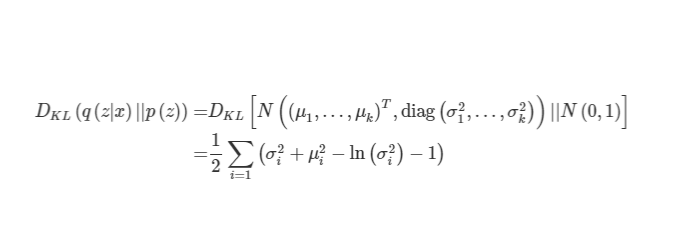

# MusicVAE[4-bar drum]

# - 데이터 전처리

1. 4/4 박자 확인하고 아니면 패스
2. pm.instruments.is_drum ⇒ 드럼곡인지 확인
3. 퀀타이즈  
4. 3차원 배치로 변환(window)
5. 원핫인코딩
6. pickle 형식으로 저장

# - 학습

- **모델링**
    
    **Encoder: bidirectional 1-layer RNN**  
    
    ```python
    eps = torch.randn_like(std)  # Reparameterization trick
    z = mu + (eps * std)   
    ```
    
    ⇒ sampling 함수가 random node 이므로 역전파 불가
    
    **∼ N (0, I), z = µ + σ**
    
    ⇒ normal distribution 을 따르는 eps 를 샘플링해서 std와 곱하고 mu 와 더하면 latent space 의 확률분포와 같다고 함
    
    **Conductor: unidirectional 2-layer RNN**
    
    **Decoder unidirectional 2-layer RNN**
    
- **학습**
    1. encoder[512, 1024, 512], conductor[512, 512], decoder[512, 1024] 생성
    2. 옵티마이저 할당(Adam)
    3. ‘encoder, conductor’ forward
        
        
        
    4. decoder 에 입력할 x_train_inputs과 x_train_label 0으로 초기화
        
        
        
        4.1 conductor 가 생성한 U 임베딩 벡터($c = {c1, c2, . . . , cU }$), 즉 마디마다  $y_u$ 에 해당하는 시퀀스 생성
        
        4.2 마디마다 hidden state, cell state 초기화
        
    5. epoch 초기에는 teacher forcing 확률을 높여 학습
    
    ```python
    if np.random.binomial(1, inverse_sigmoid(i)):
        x_train_inputs = x_train[:, j, :].unsqueeze(1)
    else:
        x_train_inputs = F.one_hot(label, num_classes=output_size)
    ```
    
    1. kl_annealing 으로 $B$ 값 구하고 loss function 실행
        
        ⇒ kl_annealing: 학습 초기에는 beta 값을 작게 하여 latent z에 의미 있는 정보가 담기도록 강제
        
    2. loss function
        
        
        
        ⇒ 최종적으로 구해야 할 loss function
        
        
        
        ⇒ KL Divergence
        
    
    ```python
    def vae_loss(recon_x, x, mu, std, beta=0):
        logvar = std.pow(2).log()
        BCE = F.binary_cross_entropy(recon_x, x, reduction='sum')
        KLD = -0.5 * torch.sum(1 + logvar - mu.pow(2) - logvar.exp())
    
        return BCE + (beta * KLD)
    ```
    

# 3. 생성

1. predict 함수 생성
2. 임의의 sequence 생성
3. 원핫인코딩 처리 후 predict 함수의 인자로 입력

.png "Title")